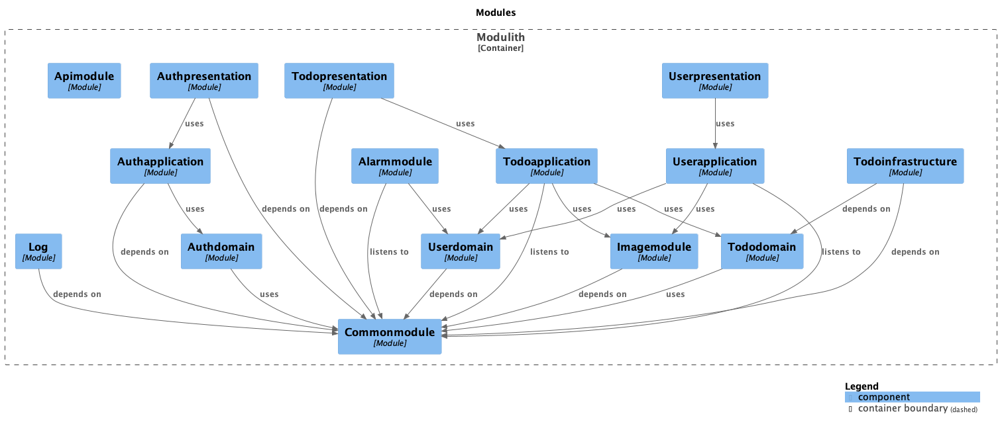

# Pawith-Server Repository

## Module Dependencies

## 성능 개선

~~~
    * 이미지 업로드 + 팀 생성 API 개선
      * 리팩터링 전 : 이미지 업로드 API + 팀 생성 API, 동시100명 요청 평균 160ms
      * 리팩터링 후 : 이미지 업로드(비동기) + 팀 생성 API , 동시 100명 요쳥 평균 98.3ms(60% 개선)

    * Todo 완료율 API 개선
      * 리팩터링 전 : 동시 100명 요청 평균 426ms
      * 리팩터링 후 : 동시 100명 요청 평균 67ms (535% 개선)

    * Todo 조회 API 개선
      * 리팩터링 전 : 동시 100명 요청 평균 915ms
      * 리팩터링 후 : 동시 100명 요청 평균 85ms(914% 성능개선)
   
    * Todo 모임 조회 API 개선
      * 리팩터링 전 : 동시 100명 요청 평균 202ms
      * 리팩터링 후 : 동시 100명 요청 평균 88ms(129% 성능개선)
  
    * Todo 모임 이름 조회 API 개선
      * 리팩터링 전 : 동시 100명 요청 평균 225ms
      * 리팩터링 후 : 동시 100명 요청 평균 63ms(257% 성능개선)

    * 카테고리 하위 Todo 조회 API 개선(테스트 데이터 24000개 레코드)
      * 리팩터링 전 : 단건 조회 41000ms
      * 리팩터링 후 : 단건 조회 800ms(5025% 성능 개선)
~~~